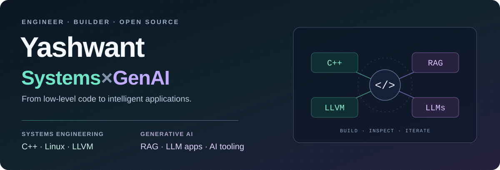

  <picture>
    <source media="(max-width: 600px)" srcset="./assets/header-mobile.svg" />
    
  </picture>

  <strong>Systems Software Engineer at IBM India Software Labs · M.Tech, IIIT Delhi</strong>

  <a href="#selected-work">Projects</a> &nbsp; / &nbsp;
  <a href="https://github.com/qualcomm/eld/pulls?q=is%3Apr+author%3Ayashwant938+is%3Amerged">Merged contributions</a> &nbsp; / &nbsp;
  <a href="https://www.linkedin.com/in/yash-rana-3a7252265/"><strong>Let's connect ↗</strong></a>

I build across **systems engineering and generative AI**—from C++ linker fixes and Linux concurrency to retrieval-backed assistants and LLM-powered developer tools.

I care about what happens around the core algorithm: **reproducible failures, useful evidence, reliable APIs, and a product people can inspect and use.**

## Selected work

<table>
<tr>
<td width="50%" valign="top">
<strong>GENAI · RAG · INFORMATION RETRIEVAL</strong>
<h3><a href="https://github.com/ZainiiiBoyx278/legal-lens">Legal Lens 2.0</a></h3>

Contributed a RAG research workspace with hybrid BM25 + MiniLM search, page-linked PDF evidence, a grounded assistant, and cited brief exports.

Local question classification handles uncertainty; the assistant can fall back to source excerpts.

<code>Python</code> <code>FastAPI</code> <code>Next.js</code> <code>MiniLM</code>

<a href="https://github.com/ZainiiiBoyx278/legal-lens#readme">Code &amp; architecture →</a> · <a href="https://github.com/ZainiiiBoyx278/legal-lens/pulls?q=is%3Apr+author%3Ayashwant938+is%3Amerged">My merged PRs</a>
</td>
<td width="50%" valign="top">
<strong>SYSTEMS · C++ · OPEN SOURCE</strong>
<h3><a href="https://github.com/qualcomm/eld">Qualcomm ELD contributions</a></h3>

<strong>Two merged fixes</strong> in an ELF linker built on LLVM:

<ul>
<li><a href="https://github.com/qualcomm/eld/pull/2065"><strong>#2065</strong></a> — Fixed an ELF-header layout crash.</li>
<li><a href="https://github.com/qualcomm/eld/pull/2011"><strong>#2011</strong></a> — Added GNU-compatible handling of numeric <code>-O</code> options.</li>
</ul>

Focused regression testing across six architecture configurations. Each PR records the verification scope.

<code>C++</code> <code>LLVM</code> <code>Linux</code> <code>lit / FileCheck</code>

<a href="https://github.com/qualcomm/eld/pulls?q=is%3Apr+author%3Ayashwant938">Explore the contributions →</a>
</td>
</tr>
<tr>
<td width="50%" valign="top">
<strong>GENAI × SYSTEMS · DEVELOPER TOOLS</strong>
<h3><a href="https://github.com/yashwant938/LLVMBugSquad">LLVM BugSquad</a></h3>

Model-assisted compiler triage with isolated workers, persistent history, resumable events, and evidence exports.

<strong>Status:</strong> synthetic replay demo available. Model adapter and worker implemented; live integration validation pending.

<code>Python</code> <code>FastAPI</code> <code>Docker</code> <code>LLM APIs</code>

<a href="https://github.com/yashwant938/LLVMBugSquad#readme">Architecture &amp; implementation →</a>
</td>
<td width="50%" valign="top">
<strong>GENAI · FULL-STACK APPLICATIONS</strong>
<h3><a href="https://github.com/yashwant938/NewsScript">NewsScript</a></h3>

Turns RSS articles into structured script drafts through optional Gemini/OpenAI generation, with saved articles and text/PDF exports.

<strong>Status:</strong> local prototype with a template fallback. Live-provider validation and deployment hardening are pending.

<code>TypeScript</code> <code>Next.js</code> <code>Prisma</code> <code>LLM APIs</code>

<a href="https://github.com/yashwant938/NewsScript#readme">Explore the application →</a>
</td>
</tr>
</table>

## Systems & machine-learning foundations

- **[C++ Filesystem & Concurrency Lab](https://github.com/yashwant938/OOPD-Project)** — Sequential and threaded filesystem commands, recursive traversal, and workload timing scripts. **C++17 · Linux**
- **[GPT-2 Review Summarization](https://github.com/yashwant938/CSE508_Winter2024_A4_MT23107)** — Coursework experiment covering fine-tuning and generation with **PyTorch / Hugging Face**. Experimental; evaluation corrections and reproduction steps are documented.

**More things I've built:** [MoodPet desktop companion](https://github.com/yashwant938/MoodPet) · [Interactive C++ Concepts Lab](https://github.com/yashwant938/CompilerCppTopics) · [Real-time multiplayer quiz](https://github.com/yashwant938/quizzesbyiron)

<strong>More open-source work &amp; engineering practice</strong>

- **[ARM/AArch64 LTO fix · #2129](https://github.com/qualcomm/eld/pull/2129)** — Preserve native object generation with `--save-temps`. Full LTO, ThinLTO, and explicit assembly-output coverage; 16 focused tests passed.
- **[Build guidance · #2127](https://github.com/qualcomm/eld/pull/2127)** — Document the LLVM `main` baseline and source/build path guidance following a [maintainer discussion](https://github.com/qualcomm/eld/discussions/887#discussioncomment-18761658).
- **[DSA practice](https://github.com/yashwant938/DSA)** — Ongoing algorithms and problem-solving work.

The two PRs above were open as of October 10, 2026. ELD verification used focused tests, not the full suite.

## Toolbox

| Systems engineering | GenAI & applied ML | Backend & delivery |
| :--- | :--- | :--- |
| C / C++, Linux, GDB | RAG, BM25, MiniLM, RRF | Python, FastAPI, SQL |
| LLVM, CMake, Ninja, lit | LLM APIs, PyTorch, Hugging Face | TypeScript, Next.js, Docker |

---

**Let's build at the intersection of systems and AI.** [Connect on LinkedIn →](https://www.linkedin.com/in/yash-rana-3a7252265/)
